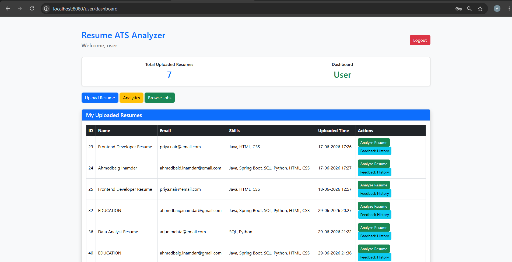
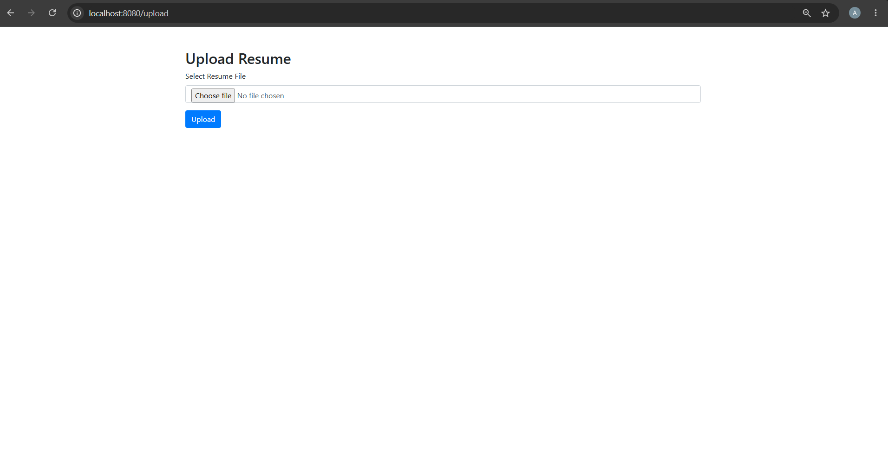
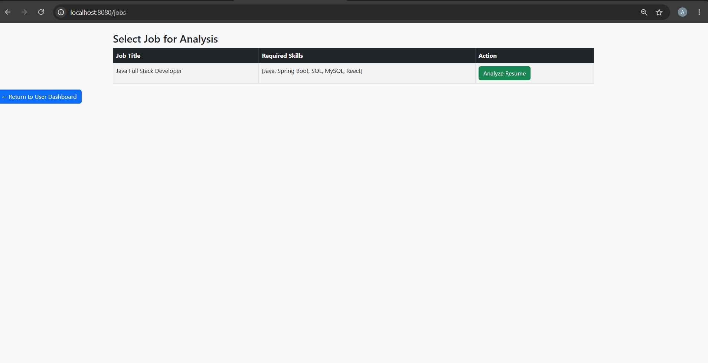
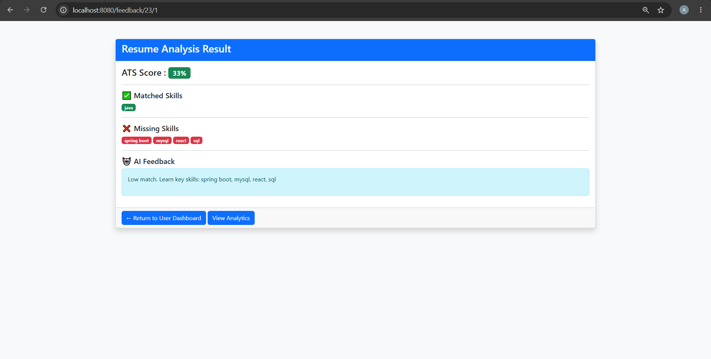
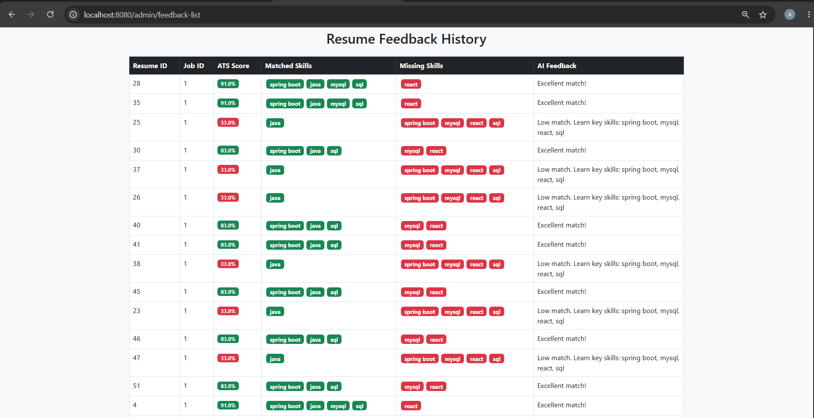
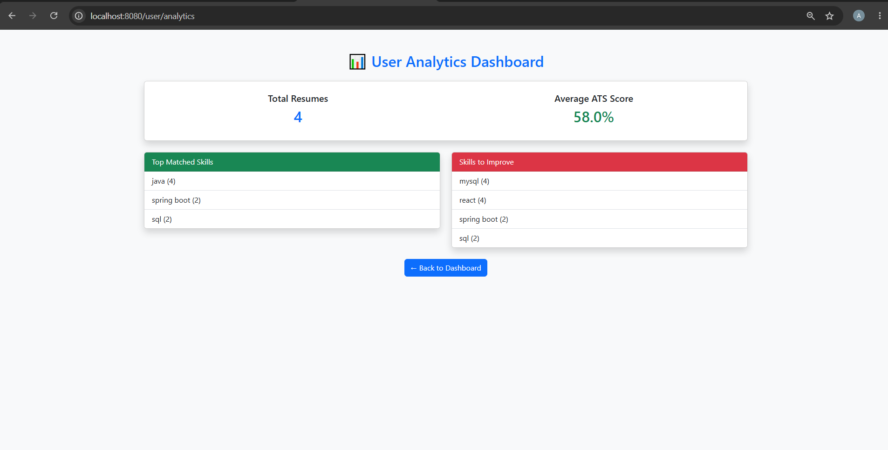
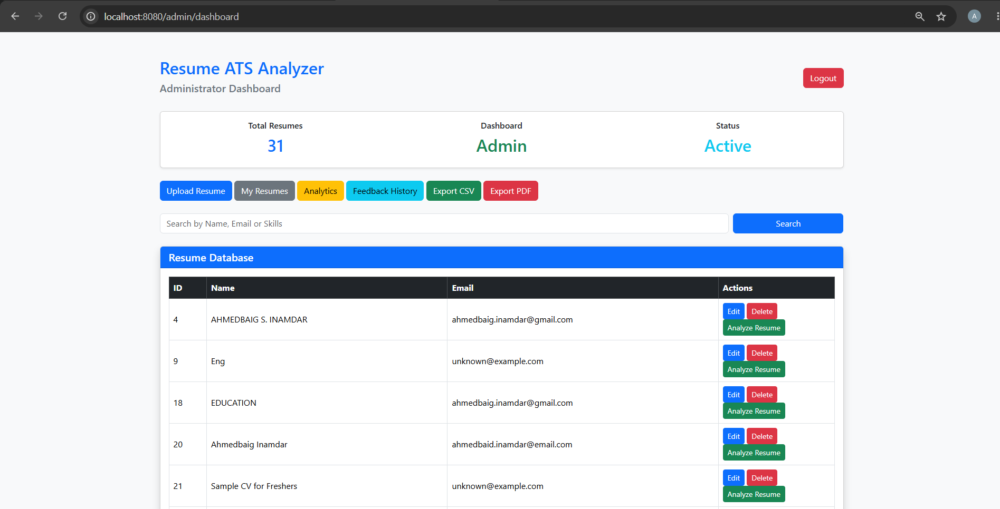
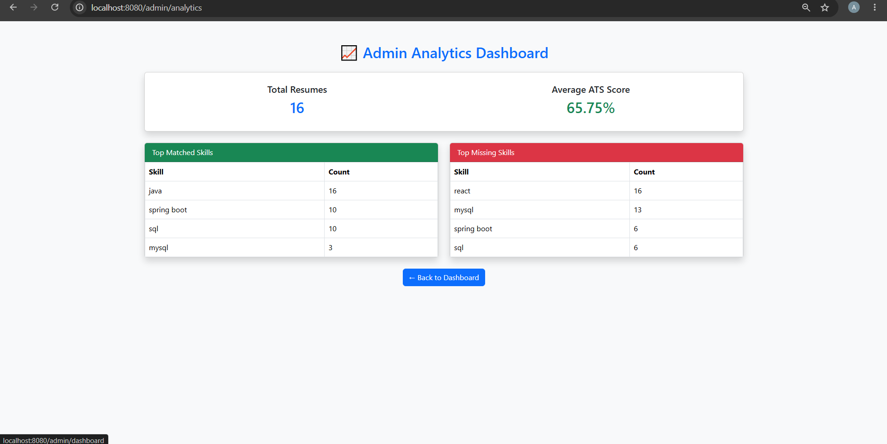

# 🚀 Resume ATS (Applicant Tracking System) with AI Feedback Engine


---

## 📌 Overview

**Resume ATS** is an AI-powered full-stack web application designed to automate resume screening, skill extraction, and job matching using:

- Spring Boot (Backend)
- MySQL (Database)
- Thymeleaf (Frontend)
- Ollama AI (LLM-based feedback engine)

It intelligently analyzes resumes and provides **AI-driven career improvement suggestions**, simulating real-world ATS systems used in modern companies.

---

## 🎯 Key Features

- 📤 Upload Resume (PDF)
- 📄 Automatic Resume Parsing (Apache Tika)
- 🧠 Skill Extraction Engine
- 🔍 Job Description Matching System
- 🤖 AI Feedback using Ollama LLM
- 👤 Role-Based Access (Admin / User)
- 📊 Admin Analytics Dashboard
- 📚 Feedback History Tracking
- 📥 Export Reports (CSV / PDF)
- 🔎 Resume Search (Name, Skills, Email)

---

## 🏗️ System Architecture

```
Controller Layer  → Handles HTTP Requests
Service Layer     → Business Logic + AI Processing
Repository Layer  → Database Interaction (JPA)
View Layer        → Thymeleaf UI
AI Layer          → Ollama LLM Integration
```

---

## 🤖 AI Integration (Ollama)

This project integrates **Ollama LLM (Local AI Model)** to generate intelligent resume feedback.

### AI Capabilities:
- Resume quality evaluation
- Skill gap detection
- Job matching score
- Personalized improvement suggestions
- Career guidance recommendations

---

## ⚙️ Tech Stack

### Backend
- Java 17+
- Spring Boot
- Spring MVC
- Spring Security
- Spring Data JPA

### Frontend
- Thymeleaf
- HTML5
- Bootstrap 5

### Database
- MySQL

### AI Engine
- Ollama LLM (Local AI)

### Libraries
- Apache Tika (PDF Parsing)
- Apache Commons CSV (Export)
- iText PDF (Reports)

---

## 🔄 Workflow

1. User Login (Spring Security)
2. Upload Resume (PDF)
3. Extract Text using Apache Tika
4. Store structured data in MySQL
5. Select Job Description
6. Skill Matching Engine runs
7. AI Engine (Ollama) generates feedback
8. Results displayed to user/admin

---

## 👥 User Roles

### 🧑 User
- Upload Resume
- View AI Feedback
- Check Job Match Results
- View History

### 👨‍💼 Admin
- Manage All Resumes
- View Analytics Dashboard
- Export Data (CSV/PDF)
- View Feedback Logs

---

## 📸 Screenshots

### 🏠 User Dashboard


### 📤 Upload Resume


### 🔍 Jobs Page


### 🤖 AI Feedback


### 📚 Feedback History


### 📊 Analytics


### 🧑‍💼 Admin Dashboard


### 📈 Admin Analytics Detail

---

## 📁 Project Structure

```
com.Resume.ATS
├── controller
├── service
├── repository
├── model
├── dto
├── security
├── util
├── config
└── templates
```

---

## 🚀 Setup Instructions

### 1️⃣ Clone Repository
```bash
git clone https://github.com/your-username/resume-ats.git
```

### 2️⃣ Import Project
- Open IntelliJ / Eclipse
- Import as Maven Project

### 3️⃣ Configure Database
```properties
spring.datasource.url=jdbc:mysql://localhost:3306/ats_db
spring.datasource.username=root
spring.datasource.password=your_password
```

### 4️⃣ Run Project
```bash
mvn spring-boot:run
```

---

## 🌐 Application URL

```
http://localhost:8080
```

---

## 🚀 Future Enhancements

- AI Resume Ranking System
- Interview Question Generator
- Email Notifications
- Cloud Deployment (AWS / Azure)
- Advanced NLP Skill Detection
- Real-time AI Chat Assistant

---

## 👨‍💻 Author

**Ahmedbaig Inamdar**  
Full Stack Java Developer  
Spring Boot | MySQL | AI (Ollama) | Web Development

---

## ⭐ Highlights

✔ AI-powered ATS system  
✔ Real-world recruitment automation  
✔ Production-grade Spring Boot architecture  
✔ Ollama LLM integration  
✔ Role-based secure system
